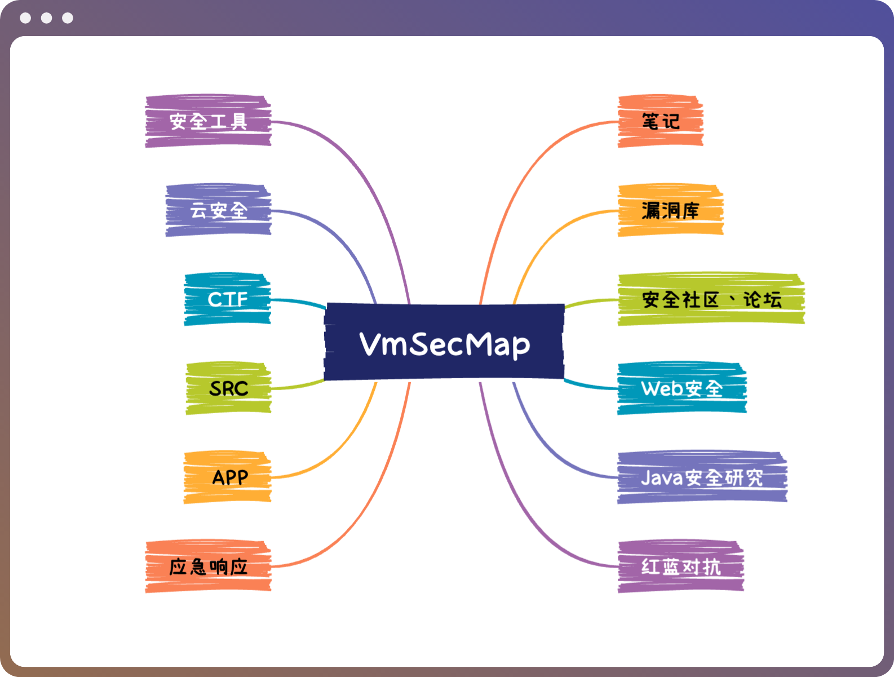

# VmSec

## WHOAMI

隐雾安全（隐此朦胧间，雾起御龙回）团队: 目标是有内涵、有深度的安全团队。

## 知识框架简介

- **简介** : 隐雾安全创建本知识框架的目的是整合安全圈零散的资源、体系化知识，让更多人更系统、全面的了解、学习网络安全。
- **目标** : 做一个全面、有深度的网络安全知识框架
- **更新时间** : 至少每周一更
- **建议** : 善用`Ctrl/Cmd + F`，全文搜索
- **issues** : 如有好的建议，或者对知识内容有需求，都可以提issues
- **知识库** : 隐雾安全的团队知识库: https://docs.vmsec.live

## 知识框架

### Web安全

* Web安全基础
    * 数据库
    * 计算机网络
    * 前端

* 信息收集
    * 

* Web漏洞
    * SQL注入
        * [SQL注入WIKI（MySQL、Oracle、SQL Server的注入、攻击面WIKI）](http://sqlwiki.radare.cn/#/attackQueries/dataExfiltration)
        * [数据库的入门知识总结](https://zone.huoxian.cn/d/1041)
        * MySQL
            * [mysql数据库基础](https://www.freebuf.com/articles/database/319405.html)
            * [数据库攻防之MySQL](https://www.freebuf.com/articles/network/336461.html)
            * [Mysql利用姿势小结](https://www.freebuf.com/articles/web/243136.html)
            * [SQL注入之Mysql注入姿势及绕过总结](https://xz.aliyun.com/t/10594)
            * [MySQl提权 mof、udf过程详解](https://mp.weixin.qq.com/s/2HgKB-UAvbV0jOSdXLOW-Q)
            * [数据库MySQL提权](https://xz.aliyun.com/t/10373)
            * [MySQL实战环境下的提权技巧及坑点总结](https://mp.weixin.qq.com/s/U6zc2BOjANQw4zq4hqehUw)
        * MSSQL
            * [从0开始学习Microsoft SQL Server数据库攻防](https://xz.aliyun.com/t/10955)
            * [数据库安全之MSSQL渗透](https://www.freebuf.com/vuls/276814.html)
            * [SQLserver写Webshell总结-突破中文路径](https://xz.aliyun.com/t/10375)
            * [一次另类的mssql渗透之路](https://xz.aliyun.com/t/11303)
            * [干货|mssql注入实战总结之狠快准绕](https://xz.aliyun.com/t/9619)
            * [MSSQL数据库攻防实战指北](https://xz.aliyun.com/t/9475)
            * [关于站库分离数据库不出网落地Exe方式探究-Mssql](https://xz.aliyun.com/t/10976)
            * [MSSQL注入之无回显利用实战案例](https://mp.weixin.qq.com/s/nc09g29ZhQ7FHugeReNavQ)
            * [mssql 提权总结](http://tttang.com/archive/1545/)
        * Oracle
            * [关于学习Oracle注入](https://xz.aliyun.com/t/7897)
            * [Oracle 注入 All in ONE](https://xz.aliyun.com/t/8020)
            * [Oracle数据库注入全方位利用](https://xz.aliyun.com/t/9940)
            * [一篇文章入门Oracle注入](https://mp.weixin.qq.com/s/PFshxMifniKk941pf-OaDg)
            * [Oracle 注入bypass总结](https://xz.aliyun.com/t/10469)
        * PostgreSQL
            * [Postgresql 渗透总结](http://tttang.com/?keyword=postgresql)
            * [PostgreSQL从未授权到高权限命令执行](https://mp.weixin.qq.com/s/t7xn7h0B9RcNpaSuVS8_Vg)
            * [SQL注入渗透PostgreSQL(bypass tricks)](https://xz.aliyun.com/t/8621)
            * [红队的 PostgreSQL 攻击教程](https://xz.aliyun.com/t/4168)
        * SQLMAP
            * [SQLMAP深度解析及使用手册](https://www.freebuf.com/news/196755.html)
            * [记一份SQLmap使用手册小结（一）](https://xz.aliyun.com/t/3010)
                [记一份SQLmap使用手册小结（二）](https://xz.aliyun.com/t/3011)
            * [实战sqlmap绕过WAF](https://mp.weixin.qq.com/s/5NmGd0L9smXKtN-XsQe0VA)
            * [sqlmap --os-shell原理](https://xz.aliyun.com/t/7942)
        * 技巧
            * [关于sql注入的一些技巧以及问题](https://mp.weixin.qq.com/s/gPwVNeXt9Tc5wh0TgbTa9A)
            * [记一次mssql注入到getshell](https://mp.weixin.qq.com/s/97FXB_fVyI74M1oe5JFtaA)
            * [记一次艰难的SQL注入(过安全狗)](https://mp.weixin.qq.com/s/e-F_I_uPOTXVxV4xpngS2w)
            * [MYSQL_SQL_BYPASS_WIKI](https://github.com/aleenzz/MYSQL_SQL_BYPASS_WIKI)
            * [MSSQL_SQL_BYPASS_WIKI](https://github.com/aleenzz/MSSQL_SQL_BYPASS_WIKI)
    * XSS
        * [XSS教程-基础入门](https://www.freebuf.com/articles/web/271765.html)
        * [浅谈XSS](https://forum.butian.net/share/156)
        * [DOM型XSS](https://www.freebuf.com/articles/web/306031.html)
        * [XSSLab保姆级教程](http://tttang.com/archive/1433/)
        * [XSS编码浅析](https://forum.butian.net/share/831)
        * [富文本存储型XSS的模糊测试之道](http://tttang.com/archive/1245/)
        * [XSS攻击与利用](https://www.freebuf.com/articles/web/283333.html)
        * [xss备忘录](https://mp.weixin.qq.com/s/PYHJ3nfhQQfN6I2lxdGhwA)
        * [XSS 实战攻击思路总结](https://mp.weixin.qq.com/s/SrWD-YWMa-0zvDwmTymHFw)
        * [HTTP only下XSS劫持登录表单到内网沦陷](https://mp.weixin.qq.com/s/GvmW-i4tcCjXFUHLnfk1vQ)
        * [CSP浅析与绕过](https://www.freebuf.com/articles/network/272918.html)
        * [CSP常见配置及绕过姿势](https://www.freebuf.com/articles/web/260535.html)
        * [同源策略那些事](https://xz.aliyun.com/t/6614)
        * [前段防御从入门到弃坑--CSP变迁](https://xz.aliyun.com/t/10)
        * [谭谈 XSS 那些世人皆知的事](https://xz.aliyun.com/t/9606)
    * 跨域漏洞
        * [跨域方法总结](https://xz.aliyun.com/t/224)
        * [同源策略，跨域漏洞初探-CORS](https://mp.weixin.qq.com/s/xHnSlPNBPDwqCoSSRWNoIQ)
        * [cors安全完全指南](https://xz.aliyun.com/t/2745)
        * [前端跨域安全](https://www.freebuf.com/articles/network/167851.html)
        * [JSONP与JSONP劫持漏洞的学习](https://xz.aliyun.com/t/10051)
        * [浅析CORS攻击及其挖洞思路](https://xz.aliyun.com/t/7242)
        * [错误配置CORS的3种利用方法](https://xz.aliyun.com/t/4663)
        * [实战渗透分享——cors泄露id导致越权](https://mp.weixin.qq.com/s/gnTs_KrO9RlwGWhR0qQUxQ)
    * CSRF
        * [邪恶的CSRF](http://tttang.com/archive/1246/)
        * [csrf漏洞浅谈](https://xz.aliyun.com/t/8514)
        * [CSRF攻击技术浅析](https://xz.aliyun.com/t/8186)
        * [一次渗透测试引发的Json格式下CSRF攻击的探索](https://xz.aliyun.com/t/7911)
        * [从0到1完全掌握 CSRF](https://www.freebuf.com/articles/web/333173.html)
        * [实战 | CSRF拿下盗图狗后台](https://mp.weixin.qq.com/s/Tm-CATRBY-9Ykp27k50FLQ)
    * SSRF
        * [SSRF安全指北](https://www.freebuf.com/vuls/262047.html)
        * [浅析SSRF原理及利用方式](https://www.anquanke.com/post/id/145519)
        * [SSRF的利用方式](https://www.freebuf.com/articles/web/265646.html)
        * [浅析SSRF的各种利用方式](https://xz.aliyun.com/t/11215)
        * [SSRF检测的一些思考](https://xz.aliyun.com/t/11050)
        * [迷糊的提权方式以及利用ssrf到最终提权靶机](https://xz.aliyun.com/t/10811)
        * [记一次密码读取+SSRF渗透测试](https://xz.aliyun.com/t/9950)
        * [手把手带你用 SSRF 打穿内网](https://xz.aliyun.com/t/9554)
        * [记一次从盲SSRF到RCE](https://xz.aliyun.com/t/9589)
        * [某通用流程化管控平台SSRF到RCE之旅](https://forum.butian.net/share/136)
    * XXE
        * [XXE从入门到放弃](https://www.anquanke.com/post/id/197423)
        * [原创 | 纸上得来终觉浅—XXE大杂烩](https://mp.weixin.qq.com/s/AQ0dM6kdZBrMcAZenzlp3A)
        * [XXE学习笔记](https://www.freebuf.com/vuls/317253.html)
        * [浅析无回显的XXE（Blind XXE）](https://www.freebuf.com/articles/web/332937.html)
        * [盲XXE攻击 -带外交互技术(OAST) 泄露数据](https://xz.aliyun.com/t/9519)
        * [XXE Bypass WAF](https://www.anquanke.com/post/id/170655)
        * [3种XXE不同攻击方式](https://mp.weixin.qq.com/s/txgCYh2P4LR2EDE_1TsqHw)
        * [Oracle盲注结合XXE漏洞远程获取数据](http://tttang.com/archive/482/)
        * [利用Excel进行XXE攻击](https://mp.weixin.qq.com/s/M92S51DPIXQRxfrmGn18Pg)
        * [浅谈一种特殊格式的xxe](https://xz.aliyun.com/t/11203)
    * 文件上传
        * [文件上传攻击](https://mp.weixin.qq.com/s/kkr2vxCP3ileY22yo4ivOA)
        * [『渗透测试』文件上传漏洞](https://mp.weixin.qq.com/s/NGe9kcjhpJg_pRTaqDSnuQ)
        * [尽可能详细的文件上传讲解](https://www.anquanke.com/post/id/273252)
        * [对文件上传的一些思考和总结](https://www.anquanke.com/post/id/164561)
        * [web安全-文件上传利用](https://mp.weixin.qq.com/s/Q4wN01H4fh_ATUnPwng3Ag)
        * [某次攻防文件上传绕过-getshell](https://mp.weixin.qq.com/s/0xo1V40AUxvMPQNzlpUPgw)
        * [记一次绕过waf的任意文件上传](https://xz.aliyun.com/t/11337)
        * WebShell客户端
            * 
    * 文件包含
        * [浅析文件包含](https://www.freebuf.com/articles/web/331562.html)
        * [文件包含漏洞学习小结](https://www.freebuf.com/articles/web/291633.html)
        * [PHP文件包含小总结](https://mp.weixin.qq.com/s/IT6bbaG7zBbnrvcNPYr1_w)
        * [PHP远程文件包含（RFI）并绕过远程URL包含限制](https://mp.weixin.qq.com/s/VtH78ghWKWts6Ru0q4PvpQ)
        * [浅谈文件包含漏洞](https://xz.aliyun.com/t/7176)
    * 其他文件漏洞
        * [渗透经验分享之文件操作漏洞拓展](https://mp.weixin.qq.com/s/2jewPk8GucQUJjsGgg7eRg)
        * [一次文件读取漏洞的“危害升级”历程](https://www.freebuf.com/vuls/257629.html)
        * [任意文件读取漏洞的曲折历程](https://www.freebuf.com/articles/web/229648.html)
        * [一个有趣的任意文件读取](https://xz.aliyun.com/t/2589)
    * RCE
        * [浅析命令执行](https://xz.aliyun.com/t/10947)
        * [浅析命令执行](https://www.freebuf.com/articles/web/284155.html)
        * [无参数命令执行学习](https://xz.aliyun.com/t/10780)
        * [论如何利用可控参数拼接完成RCE](https://mp.weixin.qq.com/s/HuFS6LfcwujmKutRfdJ8DQ)
        * [命令执行漏洞概述](https://www.freebuf.com/articles/web/250350.html)
        * [RCE bypass的一些小技巧](https://www.freebuf.com/articles/web/330833.html)
        * [年轻人如何挖掘第一个RCE](https://mp.weixin.qq.com/s/3phgI8yaPns3Dx5oSkdeYg)
        * [从RCE到CVE：攻防实战中的漏洞挖掘](https://mp.weixin.qq.com/s/xsCowdMIyXSiPPOj9wIIjQ)
    * 未授权访问

### Java安全研究

* JavaSE
* JAVAEE
* JavaWeb
* Java安全基础
    * [Java安全笔记-JNI 详解](https://tttang.com/archive/1622/)
    * [浅谈加载字节码相关的Java安全问题](https://4ra1n.love/post/5w2gq6wvb/)
* Web漏洞分析
    * [java代码审计](https://xz.aliyun.com/t/7945#toc-0)
    * [JavaWeb代码审计](https://su18.org/post/code-audit/)
    * JNDI注入
        * [JNDI注入分析](https://tttang.com/archive/1611/)
    * 反序列化
        * [Java RMI 攻击由浅入深](https://su18.org/post/rmi-attack/)
        * [Hessian 反序列化知一二](https://su18.org/post/hessian/)
* ysoserial
    * [Java 反序列化取经路](https://su18.org/post/ysuserial/)

* Nday漏洞分析
    * Log4j2
        * [Log4j2：里程碑式的顶级供应链漏洞](https://su18.org/post/log4j2/)
        * [Apache Log4j2从RCE到RC1绕过](https://4ra1n.love/post/hbHrd-lpH/)
        * [浅谈Log4j2不借助dnslog的检测](https://4ra1n.love/post/I_AYmmK2J/)
    * FastJson
        * [fastjson：我一路向北，离开有你的季节](https://su18.org/post/fastjson/)
        * [Fastjson 反序列化分析](https://tttang.com/archive/1579/)
        * [某JSON利用链深入研究分析](https://4ra1n.love/post/DXMxi-MCu/)
    * Shiro
        * [从 CVE 学 Shiro 安全](https://su18.org/post/shiro-5/)
    * SpringBoot
        * [SpringBoot Actuator之 logging.config grovvy rce分析及内存马注入](https://tttang.com/archive/1620/)
    * RuoYi
    * Struts2
        * [Struts2 系列漏洞调试总结](https://su18.org/post/struts2-5/)
    * Weblogic
* 内存马
    * [JavaWeb 内存马一周目通关攻略](https://su18.org/post/memory-shell/)
    * [JavaWeb 内存马二周目通关攻略](https://su18.org/post/memory-shell-2/)
* 软件分析技术
* CodeQL
* GadgetInspector
* RASP
* IAST

### 红蓝对抗

* 信息收集
* 敏感资产探测
* 常见漏洞利用与提权
* 流量对抗
* 内网穿透
* 横向移动
* 权限提升
* 权限维持
* 痕迹清理
* CS
* MSF

### 应急响应

* [应急响应实战笔记](https://github.com/Bypass007/Emergency-Response-Notes)
* [应急响应指南](https://github.com/theLSA/emergency-response-checklist)
* [应急响应资料收集](https://github.com/starnightcyber/Emergency-Material-Collection)
* Windows
    * [应急响应之windows入侵排查篇](https://mp.weixin.qq.com/s/EIwz2N3hlQuAetjsvSZh7g)
    * [Windows应急响应入门手册](https://mp.weixin.qq.com/s/Ey52wbSpEOSRh1Nd0Ej1CQ)
* Linux
    * [linux应急常用命令+技巧总结](https://mp.weixin.qq.com/s/KhcXJo0_9YAgjp2r074f_A)
    * [Linux 应急响应手册](https://mp.weixin.qq.com/s/So3UVWL8NbvzzwPTfM625A)
* 实战案例
    * [主机被入侵分析过程报告](https://tttang.com/archive/710/)
    * [一次入侵应急响应分析](https://www.freebuf.com/articles/network/186071.html)
    * [一起钓鱼邮件的应急响应](https://www.freebuf.com/articles/system/256049.html)
    * [记编辑器漏洞引发的应急处理](https://mp.weixin.qq.com/s/uxsYaJRRKVNX4nAvyMtJiw)
    * [记一次Windows下的应急过程](https://mp.weixin.qq.com/s/sw2kxjxZfFU7CLxkabWN2g)

### APP

### SRC

### CTF

### 云安全

### 安全工具

